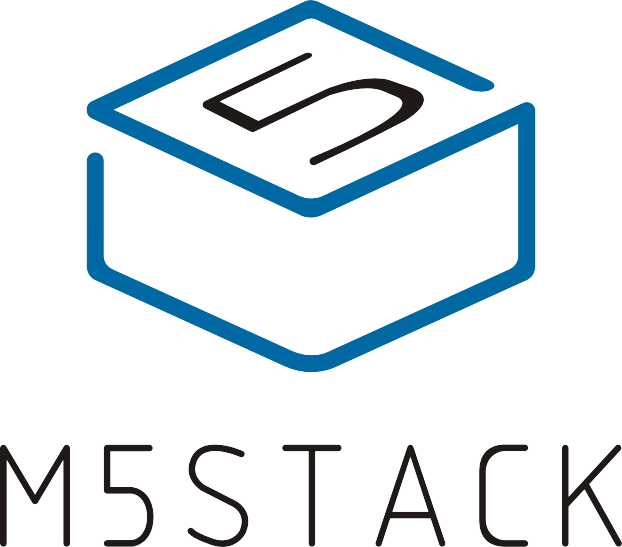

> A documentation for [M5Stack](https://www.m5stack.com)

- A series of modular stackable development devices integrating WIFI/BLE
- For Industry Development/STEM Education
- Programming with UIFlow(Blockly/MicroPython)

[Official Website](http://www.m5stack.com)
[Introdction](#main)
[Quick Start](/en/quick_start)
