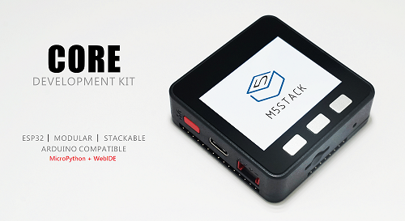
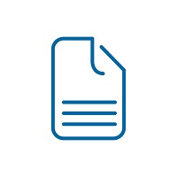
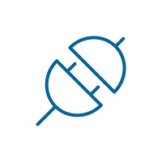

# M5Stack

<a class="github-button" href="https://github.com/watson8544/M5Stack-Documentation-docsify" data-icon="octicon-star" data-show-count="true" aria-label="Star watson8544/M5Stack-Documentation-docsify on GitHub">Star</a>

**Welcome to M5Stack Documents!**

?> **Tip** The underline words designate `more info` links leading to advanced sections about the described task.

<!-- <figure class="thumbnails">
    
</figure> -->

## Introduction

**M5 stack is a modular stackable development device. The M stands for Modular and 5 stands for the the units compact 5 x 5 cm size.**

**The M5 stack aims to take the pain out of developing your new inventions and ideas. M5 stack comes packed with sensors, wifi, bluetooth, a screen and its own power supply which avoids the inconvenience of messy wires strewn across breadboards and adding new functionality is as simple as stacking it on top of one of the many expansion modules or plugging in a unit via the handy grove connectors.**

Our a series of core boards are based on **ESP32** chip.

Our aim is "**Stackable Board is Product**". Here's the [Official Website](www.m5stack.com)

<!--
<figure class="thumbnails">
    
</figure> -->

| |  |
|:---:|:---:|
|[Product Documents](en/product_documents) | [M5Stack Cases](en/m5stack_cases) |

| | |
|:---:|:---:|
|[API Rreference](en/api_reference) | [FAQ](en/faq)|

## Contact & Support

- :computer: Visit [Official Website](www.m5stack.com) for newest product
- :busts_in_silhouette: Sign in our [Forum](http://forum.m5stack.com) for more designs with M5Stack
- :mailbox_with_mail: If you have any questions, you can contact us by [Email](tech@m5stack.com)
- :convenience_store: If you want to get our products, access our [Store](http://www.aliexpress.com/store/all-wholesale-products/3226069.html?spm=2114.12010108.100004.3.7e3a5379KoyhDo)

## License

This project is licensed under the [MIT license](https://github.com/watson8544/M5Stack-Documentation-docsify/blob/master/LICENSE).

Copyright (c) 2018 M5Stack ([@M5Stack](https://twitter.com/M5Stack))

<!-- GitHub Buttons -->
