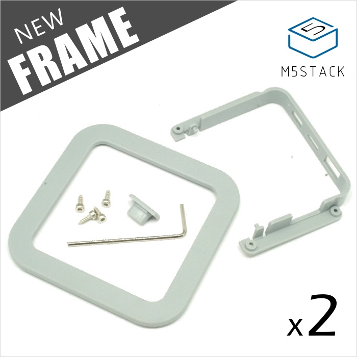

  

    

        <button id="core-btn" type="button" class="btn btn-primary" onclick="select(this)">Core</button>
    

        

        <button id="module-btn" type="button" class="btn btn-light"  onclick="select(this)">Module</button>
    

    

        <button id="base-btn" type="button" class="btn btn-light"  onclick="select(this)">Base</button>
    

    

        <button id="unit-btn" type="button" class="btn btn-light"  onclick="select(this)">Unit</button>
    

    

        <button id="application-btn" type="button" class="btn btn-light"  onclick="select(this)">Application</button>
    

        

        <button id="accessory-btn" type="button" class="btn btn-light"  onclick="select(this)">Accessory</button>
    

    

        <button id="aluminium-btn" type="button" class="btn btn-light"  onclick="select(this)">Aluminium</button>
    

  <a class="btn btn btn-primary" href="https://m5stack.oss-cn-shenzhen.aliyuncs.com/image/m5-docs_table/I2C_Address.pdf" role="button" style="color:white;text-decoration:none" target="view_window">I2C Address Table</a>
  <a class="btn btn btn-primary" href="https://m5stack.oss-cn-shenzhen.aliyuncs.com/image/m5-docs_table/Product_compared.pdf" role="button" style="color:white;text-decoration:none" target="view_window">Product Comparison</a>

  
Core

  

  <nav class="navbar-expand-sm bg-light navbar-dark nav-content">
    <ul class="navbar-nav">
      <li class="nav-item active">
        <a class="dropdown-item"  onclick="select(this)">Core</a>
      </li>
      <li class="nav-item">
        <a class="dropdown-item"  onclick="select(this)">Module</a>
      </li>
      <li class="nav-item">
        <a class="dropdown-item"  onclick="select(this)">Base</a>
      </li>
      <li class="nav-item">
        <a class="dropdown-item"  onclick="select(this)">Unit</a>
      </li>
      <li class="nav-item">
        <a class="dropdown-item"  onclick="select(this)">Application</a>
      </li>
      <li class="nav-item">
        <a class="dropdown-item"  onclick="select(this)">Accessory</a>
      </li>
      <li class="nav-item">
        <a class="dropdown-item"  onclick="select(this)">Aluminium</a>
      </li>
    </ul>
    

    <ul class="navbar-nav">
      <li class="nav-item active">
        <a class="dropdown-item" href="https://m5stack.oss-cn-shenzhen.aliyuncs.com/image/m5-docs_table/I2C_Address.pdf" target="view_window">I2C Address Table</a>
      </li>
      <li class="nav-item">
        <a class="dropdown-item" href="https://m5stack.oss-cn-shenzhen.aliyuncs.com/image/m5-docs_table/Product_compared.pdf" target="view_window">Product Comparison</a>
      </li>
    </ul>
  </nav>    

  <h3>not obtained the content, please enter the first letter of the product and search again.</h3>

**M5Core/Kit**

  <!-- <a class="btn btn btn-primary" href="#en/quick_start/m5core/m5stack_core_quick_start" role="button" style="color:white;margin-top:10px;text-decoration:none">M5Core QuickStart</a>&nbsp;&nbsp;&nbsp;&nbsp;
  <a class="btn btn btn-primary" href="https://shimo.im/sheets/GWkjHV3XyCCgwDpQ" role="button" style="color:white;margin-top:10px;text-decoration:none" data-toggle="modal" data-target="#Core_I2C">I2C AddressTable</a>&nbsp;&nbsp;&nbsp;&nbsp;
  <a class="btn btn btn-primary" href="https://shimo.im/sheets/GWkjHV3XyCCgwDpQ" role="button" style="color:white;margin-top:10px;text-decoration:none" data-toggle="modal" data-target="#Core_Compare">M5Core comparison »</a> -->

  <a href="/#/en/core/basic">
    
    
BASIC

  </a>

  <a href="/#/en/core/gray">
    
  
GRAY

  </a>

  <a href="/#/en/core/fire">
    
  
FIRE

 </a>

  <a href="/#/en/core/m5go_lite">
    
  
M5GO Lite

  </a>

  <a href="/#/en/core/m5go">
    
  
M5GO Kit

  </a>

  <a href="/#/en/core/face_kit">
    
  
FACES Kit

  </a>

**M5Stick**

  <!-- <a class="btn btn btn-primary" href="#en/quick_start/m5stick/m5stick_quick_start" role="button" style="color:white;margin-top:10px;text-decoration:none">M5Stick QuickStart</a>&nbsp;&nbsp;&nbsp;&nbsp;
  <a class="btn btn btn-primary" href="#en/quick_start/m5stickc/m5stickc_quick_start" role="button" style="color:white;margin-top:10px;text-decoration:none">M5StickC QuickStart</a>&nbsp;&nbsp;&nbsp;&nbsp;
  <a class="btn btn btn-primary" href="#en/quick_start/m5stickv/m5stickv_quick_start" role="button" style="color:white;margin-top:10px;text-decoration:none">M5StickV QuickStart</a>&nbsp;&nbsp;&nbsp;&nbsp;
  <a class="btn btn btn-primary" href="https://shimo.im/sheets/GWkjHV3XyCCgwDpQ" role="button" style="color:white;margin-top:10px;text-decoration:none" data-toggle="modal" data-target="#Stick_Compare">M5Stick comparison »</a> -->

  <a href="/#/en/core/m5stick">
    
  
M5Stick

  </a>

  <a href="/#/en/core/m5stickc">
    
  
M5StickC

</a>

  <a href="/#/en/core/m5stickv">
    
  
M5StickV

  </a>

<!-- **M5GO/FACES Kit** -->

  <!-- <a class="btn btn btn-primary" href="#en/quick_start/m5core/m5stack_core_quick_start" role="button" style="color:white;margin-top:10px;text-decoration:none">M5GO QuickStart</a>&nbsp;&nbsp;&nbsp;&nbsp;
  <a class="btn btn btn-primary" href="#en/quick_start/m5core/m5stack_core_quick_start" role="button" style="color:white;margin-top:10px;text-decoration:none">FACES-kit QuickStart »</a> -->

***

<!-- <a class="btn btn btn-primary" href="https://shimo.im/sheets/GWkjHV3XyCCgwDpQ" role="button" style="color:white;margin-top:10px;text-decoration:none" data-toggle="modal" data-target="#Module_I2C">I2C AddressTable</a>&nbsp;&nbsp;&nbsp;&nbsp; -->

**Communication Modules**

  <a href="/#/en/module/gps">
    
  
GPS

  </a>

  <a href="/#/en/module/lora">
    
  
LORA

  </a>

  <a href="/#/en/module/lorawan">
    
  
LoRaWAN

  </a>

  <a href="/#/en/module/sim800">
    
  
SIM800L

  </a>

  <a href="/#/en/module/commu">
    
  
COMMU

  </a>

  <a href="/#/en/module/lte">
    
  
LTE

  </a>

  <a href="/#/en/module/gsm">
    
  
GSM

  </a>

  <a href="/#/en/module/nb-iot">
    
  
NB-IoT

  </a>

  <a href="/#/en/module/lora868">
    
  
LORA868

  </a>

**Expansion Modules**

  <a href="/#/en/module/battery">
    
  
BATTERY

  </a>

  <a href="/#/en/module/proto">
    
  
PROTO

  </a>

  <a href="/#/en/module/plus">
    
  
PLUS

  </a>

  <a href="/#/en/module/usb">
    
  
USB

  </a>

  <a href="/#/en/module/bus">
    
  
BUS

  </a>

  <a href="/#/en/module/goplus">
    
  
GoPlus

  </a>

**Drive Modules**

  <a href="/#/en/module/stepmotor">
    
  
STEPMOTOR

  </a>

  <a href="/#/en/module/servo">
    
  
SERVO

  </a>

  <a href="/#/en/module/lego_plus">
    
  
LEGO+

  </a>

  <a href="/#/en/module/fan">
    
  
FAN

  </a>

**FACES Series**

  <a href="/#/en/module/encoder">
    
  
ENCODER

  </a>

  <a href="/#/en/module/joystick">
    
  
JOYSTICK

  </a>

  <a href="/#/en/module/faces_finger">
    
  
FINGER

  </a>

  <a href="/#/en/module/faces_rfid">
    
  
RFID

 </a>

 

***

**base** 

  <a href="/#/en/base/lan_base">
    
  
LAN

  </a>

  <a href="/#/en/base/node_base">
    
  
NODE

  </a>

  <a href="/#/en/base/btc_base">
    
  
BTC

  </a>

  <a href="/#/en/base/plc_base">
    
  
PLC

  </a>

  <a href="/#/en/base/core_bottom">
    
  
Core BOTTOM

  </a>

  <a href="/#/en/base/m5go_bottom">
    
  
M5GO BOTTOM

  </a>

  <a href="/#/en/base/m5go_rfid">
    
  
M5GO RFID

  </a>

  <a href="/#/en/base/m5go_charger">
    
  
M5GO CHARGER

  </a>

  <a href="/#/en/base/base15">
    
  
BASE15

  </a>

  <a href="/#/en/base/base26">
    
  
BASE26

  </a>

  <a href="/#/en/accessory/battery_base">
    
  
M5Camera Battery

  </a>

***

  <!-- <a class="btn btn btn-primary" href="#en/quick_start/m5camera/m5camera_quick_start" role="button" style="color:white;margin-top:10px;text-decoration:none">Camera QuickStart</a>&nbsp;&nbsp;&nbsp;&nbsp;
  <a class="btn btn btn-primary" href="https://shimo.im/sheets/GWkjHV3XyCCgwDpQ" role="button" style="color:white;margin-top:10px;text-decoration:none" data-toggle="modal" data-target="#Unit_I2C">I2C AddressTable</a>&nbsp;&nbsp;&nbsp;&nbsp;
  <a class="btn btn btn-primary" href="https://github.com/m5stack/M5-Schematic/blob/master/Units/m5camera/CameraComparison_en.md" role="button" style="color:white;margin-top:10px;text-decoration:none">Cameras comparison »</a> -->

**Camera class** 

<!-- **Camera class** *( **[Quick Start](en/quick_start/m5camera/m5camera_quick_start)**&nbsp;&nbsp;&nbsp;**[Cameras comparison](https://github.com/m5stack/M5-Schematic/blob/master/Units/m5camera/CameraComparison_en.md)** )* -->

  <a href="/#/en/unit/esp32cam">
    
  
ESP32CAM

  </a>

  <a href="/#/en/unit/m5camera">
    
  
M5Camera

  </a>

  <a href="/#/en/unit/m5camera_f">
    
  
M5CameraF

  </a>

  <a href="/#/en/unit/m5camera_x">
    
  
M5CameraX

  </a>

**Sensor class**

  <a href="/#/en/unit/env">
    
  
ENV

  </a>

  <a href="/#/en/unit/earth">
    
  
EARTH

  </a>

  <a href="/#/en/unit/light">
    
  
LIGHT

  </a>

  <a href="/#/en/unit/pir">
    
  
PIR

  </a>

  <a href="/#/en/unit/ncir">
    
  
NCIR

  </a>

  <a href="/#/en/unit/thermal">
    
  
THERMAL

  </a>

  <a href="/#/en/unit/color">
    
  
COLOR

  </a>

  <a href="/#/en/unit/tof">
    
  
TOF

  </a>

  <a href="/#/en/unit/heart">
    
  
HEART

  </a>

  <a href="/#/en/unit/adc">
    
  
ADC

  </a>

  <a href="/#/en/unit/makey">
    
  
MAKEY

  </a>

  <a href="/#/en/unit/finger">
    
  
FINGER

  </a>

  <a href="/#/en/unit/weight">
    
  
WEIGHT

  </a>

  <a href="/#/en/unit/accel">
    
  
ACCEL

  </a>

  <a href="/#/en/unit/op90">
    
  
OP.90

  </a>

  <a href="/#/en/unit/op180">
    
  
OP.180

  </a>

**I / 0  class**

  <a href="/#/en/unit/extio">
    
  
EXT.IO

  </a>

  <a href="/#/en/unit/dac">
    
  
DAC

  </a>

  <a href="/#/en/unit/relay">
    
  
RELAY

  </a>

  <a href="/#/en/unit/hub">
    
  
HUB

  </a>

  <a href="/#/en/unit/pahub">
    
  
PaHUB

  </a>

  <a href="/#/en/unit/pbhub">
    
  
PbHUB

  </a>

  <a href="/#/en/unit/396port">
    
  
3.96Port

  </a>

  <a href="/#/en/unit/m5-bit">
    
  
M5:bit

  </a>

  <a href="/#/en/unit/proto">
    
  
PROTO

  </a>

  <a href="/#/en/unit/mini-proto">
    
  
MINI-PROTO

  </a>

  <a href="/#/en/unit/unit_fan">
    
  
FAN

  </a>

  <a href="/#/en/unit/vibrator">
    
  
Vibrator-Motor

  </a>

  <a href="/#/en/unit/angle">
    
  
ANGLE

  </a>

  <a href="/#/en/unit/button">
    
  
BUTTON

  </a>

  <a href="/#/en/unit/dual_button">
    
  
Dual-BUTTON

  </a>

  <a href="/#/en/unit/joystick">
    
  
JOYSTICK

  </a>

  <a href="/#/en/unit/cardkb">
    
  
CardKB

  </a>

**Communication class**

  <a href="/#/en/unit/ir">
    
  
IR

  </a>

  <a href="/#/en/unit/gps">
    
  
GPS

  </a>

  <a href="/#/en/unit/rs485">
    
  
RS485

  </a>

  <a href="/#/en/unit/rfid">
    
  
RFID

  </a>

  <a href="/#/en/unit/laser-rx">
    
  
LASER-RX

  </a>

  <a href="/#/en/unit/laser-tx">
    
  
LASER-TX

  </a>

**LED class**

  <a href="/#/en/unit/neopixel">
    
  
RGB LED

  </a>

  <a href="/#/en/unit/hex">
    
  
HEX

  </a>

  <a href="/#/en/unit/rgb">
    
  
RGB

  </a>

**C-HAT class**

  <a href="/#/en/hat/hat-env">
    
  
ENV

  </a>

  <a href="/#/en/hat/hat-pir">
    
  
PIR

  </a>

  <a href="/#/en/hat/hat-spk">
    
  
SPK

  </a>

  <a href="/#/en/hat/hat-proto">
    
  
PROTO

  </a>

  <a href="/#/en/hat/hat-ncir">
    
  
NCIR

  </a>

  <a href="/#/en/hat/hat-thermal">
    
  
Thermal

  </a>

 

  <a href="/#/en/hat/hat-rs485">
    
  
RS485

  </a>

  <a href="/#/en/hat/hat-adc">
    
  
ADC

  </a>

  <a href="/#/en/hat/hat-dac">
    
  
DAC

 </a>

 

  <a href="/#/en/hat/hat-beetlec">
    
  
BeetleC

 </a>

  <a href="/#/en/hat/hat-proto-plus">
    
  
PROTO PLUS

 </a>

  <a href="/#/en/hat/hat-yun">
    
  
YUN

 </a>

  <a href="/#/en/hat/hat-neoflash">
    
  
Neoflash

 </a>

  <a href="/#/en/hat/hat-tof">
    
  
ToF

 </a>

  <a href="/#/en/hat/hat-joystick">
    
  
Joystick

 </a>

  <a href="/#/en/hat/hat-finger">
    
  
FINGER

 </a>

  <a href="/#/en/hat/hat-servo">
    
  
SERVO

 </a>

  <a href="/#/en/hat/hat-puppyc">
    
  
PuppyC

  </a>

  <a href="/#/en/hat/hat-8servos">
    
  
8Servos

  </a>

  <a href="/#/en/hat/hat-bugc">
    
  
BugC

  </a>

  <a href="/#/en/hat/hat-cardkb">
    
  
CardKB

  </a>

***

**Application**

  <a href="/#/en/app/bala">
    
  
BALA

  </a>

  <a href="/#/en/app/lidarbot">
    
  
LidarBOT

  </a>

  <a href="/#/en/app/piano">
    
  
PIANO

  </a>

  <a href="/#/en/app/flir">
    
  
FLIR

  </a>

  <a href="/#/en/app/demo-board">
    
  
Demo Board

  </a>

  <a href="/#/en/unit/neoflash">
    
  
NeoFlash

  </a>

  <a href="/#/en/unit/catear">
    
  
CatEar

  </a>

  <a href="/#/en/unit/butterfly">
    
  
BUTTERFLY

  </a>

  <a href="/#/en/1515/6060-push">
    
  
6060-PUSH

  </a>

  <a href="/#/en/app/m5scale_diy_kit">
    
  
M5SCALE DIY Kit

  </a>

  <a href="/#/en/app/ac_socket">
    
  
AC Socket

  </a>

  
  
PM2.5

  <a href="/#/en/base/iiot_dual_switch_kit_with_core">
    
  
IIoT Dual-Switch Kit

  </a>

***

**Accessory**

  <a href="/#/en/accessory/converter/grove_t">
    
  
Grove-T

  </a>

  <a href="/#/en/accessory/cable/grove_cable">
    
  
Grove Cable

  </a>

  <a href="/#/en/accessory/converter/grove2grove">
    
  
GROVE2GROVE

  </a>

  <a href="/#/en/accessory/screw">
    
  
SCREW

  </a>

  <a href="/#/en/accessory/bus_socket">
    
  
BUS-Socket

  </a>

  <a href="/#/en/accessory/frame">
    
  
Frame

 </a>

  <a href="/#/en/unit/trace">
    
  
TRACE

 </a>

  <a href="/#/en/module/proto_kit">
    
  
PROTO-KIT

 </a>

  <a href="/#/en/tool/usb_downloader">
    
  
USB Downloader

  </a>

  <a href="/#/en/tool/usb_isp">
    
  
USB-ISP

  </a>

  <a href="/#/en/accessory/glass_panel_repair_kit">
    
  
Glass Panel Repair Kit

  </a>

  <a href="/#/en/accessory/485t">
    
  
485T

  </a>

  <a href="/#/en/accessory/watch">
    
  
Watch

  </a>

  <a href="/#/en/accessory/sg90_servo">
    
  
SG90 servo

  </a>

***

**Aluminium Profil**

  <a href="/#/en/1515/corner">
    
  
CORNER

  </a>

  <a href="/#/en/1515/nut">
    
  
NUT

  </a>

  <a href="/#/en/1515/connectors">
    
  
Connector

  </a>

  <a href="/#/en/1515/ap">
    
  
Aluminium-Profile

  </a>

