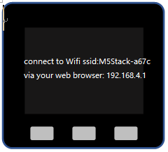
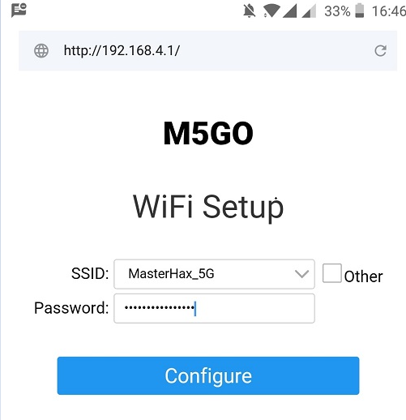
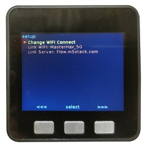

# How to Connect WIFI Using Core

?> **Tip** *If your M5Stack Core was not burnt with a specific firmware named `M5Flow` in advance, please visit this article [How to burn firmware](how_to_burn_firmware_en) for burnning)*

**After powering on Core and pressing the red button on the left hand side of the M5，you will be greeted by this screen. Let's connect to networkable AP.**

<figure>
    
</figure>

## CONTENT

1. [Press UPLOAD Button](#press-upload-button)

2. [Select Networkable AP](#select-networkable-ap)

3. [Reset Your Device](#reset-your-device)

## 1. Press `UPLOAD` Button

**Now, press the `upload` buttom. The screen will show this message.**

<figure>
    
</figure>

## 2. Select Networkable AP

**Use Mobile Phone or PC for connectting to M5Core AP(like `M5Stack-a67c`), and then open brower to login 192.168.4.1 for setting your networkable WIFI name and password. (Now, my networkable wifi is named `MasterHax_5G`)**

<figure>
    
</figure>

## 3. Reset Your Device

**After connected wifi successfully, reset your core according to the prompt on `192.168.4.1`**

<figure>
    
</figure>

## Complete

Once you've reset M5Stack Core, pressed the upload buttom, you will arrive at a screen with a QR code. Now, you can try to program with your core following this article [Quick Start with M5Flow](../quick_start/m5core/m5stack_core_get_started_MicroPython)

<figure>
    
</figure>

?> **Note** Similarly, if you want another networkable WIFI AP to connect with Core, press the SETUP buttom while core was power-up.

<figure>
    
</figure>