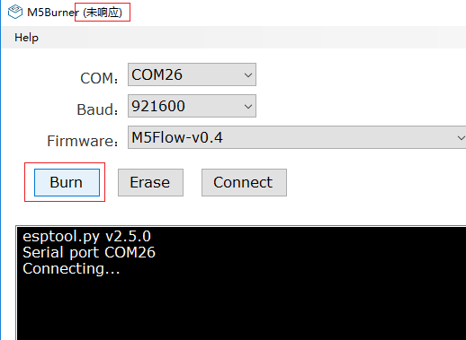

How to Burn Firmware
====================

This article will guide you how to burn a right firmware to your board via M5Burner.

For MacOS
---------

**(Coming soon...)**

For Windows
-----------

1. Download M5Burner
::::::::::::::::::::

For downloading M5Burner, visit the `offical
website <http://www.m5stack.com>`__ please.

.. image:: ../../_static/getting_started_pics/download_M5Burner.png

2. Burn the firmware
::::::::::::::::::::

Unzip the M5Burner tool which you donwloaded for official website just now, then double click ``M5Burner.exe``.

.. image:: ../../_static/getting_started_pics/burn_firmware_01.png

Then choice the ``serial port`` which is connected with your board and
the ``Baud`` which is 921600 following below steps.

.. image:: ../../_static/getting_started_pics/burn_firmware_02.png

.. note::

    If it does not display any ``COMx`` port or only ``COM1`` exists at the option, you need to visit this article `establish_serial_connection`_ and reinstall the USB driver.

.. _establish_serial_connection: establish_serial_connection.html

a. Choice a right firmware
"""""""""""""""""""""""""""

a. select ``M5Flow-vx.x`` option(the lastest version), if you want to program with
   `M5Flow <http://flow.m5stack.com>`__

b. select ``M5Cam-vx.x (/M5Cam-psram)`` option, if you own a ESP32CAM (/
   M5CAMERA)

b. Click Erase
"""""""""""""""""""""""""""

.. image:: ../../_static/getting_started_pics/burn_firmware_06.png

If M5Burner shows the information ``Hard resetting via RTS pin...``
below, it means chip has been erased successfully.

.. image:: ../../_static/getting_started_pics/burn_firmware_04.png

c. Click Burn
"""""""""""""""""""""""""""

If M5Burner shows the information ``Leaving... Staying in bootloader.``
below, it means chip has been burnt successfully..

.. image:: ../../_static/getting_started_pics/burn_firmware_05.png

3. Reset your board
::::::::::::::::::::::::::

.. note::

    * If M5Burner means be busy after clicking ``Burn``, please wait for a few minutes. It'll be normal after the firmware has been burnt successfully.

    * If the burning procedure has been interrupted(like M5Burner has been closed suddenly...), it's better to burn your board again.
