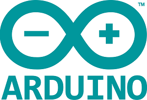
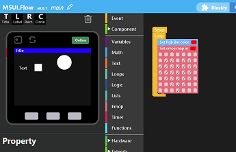

M5Stack Core Get Started
==============================================

Pick up your programming mode below for getting started
~~~~~~~~~~~~~~~~~~~~~~~~~~~~~~~~~~~~~~~~~~~~~~~~~~~~~~~~~

============================  ============================  ============================
|Arduino|_                          |Blockly|_                      |MicroPython|_
----------------------------  ----------------------------  ----------------------------
`Arduino`_                          `Blockly`_                      `MicroPython`_
============================  ============================  ============================

.. |MicroPython| image:: ../../_static/getting_started_pics/micropython_logo.png

.. _Arduino: m5stack_core_get_started_Arduino_MacOS.html
.. _Blockly: m5Stack_core_get_started_MicroPython_MacOS.html
.. _MicroPython: m5Stack_core_get_started_MicroPython_MacOS.html
