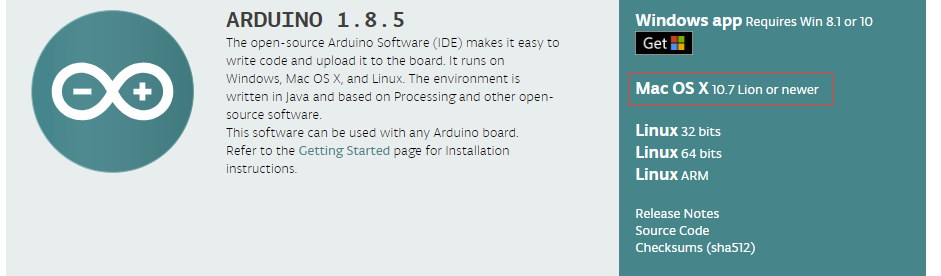

M5Stack Core Get Started(MacOS, Arduino)
========================================

.. note::
    If your OS is Windows, please click `here`_.

.. _here: m5stack_core_get_started_Arduino_Windows.html

CONTENT
~~~~~~~

1. `Setting Environment <#setting-environment>`__

   -  `1. Install Arduino IDE <#1-install-arduino-ide>`__

   -  `2. ESP32 Board Support <#2-esp32-board-support>`__

   -  `3. Install M5Stack Library <#3-install-m5stack-library>`__

2. `Upload an Example Sketch <#upload-an-example-sketch>`__

Setting Environment
~~~~~~~~~~~~~~~~~~~

.. note::

    Before setting the development environment, we suggest you confirm whether the USB driver was installed. If not, please visit this link `establish serial connection`_.

.. _establish_serial_connection: establish_serial_connection.html

1. Install ``Arduino IDE``
^^^^^^^^^^^^^^^^^^^^^^^^^^

If you don't already have the Arduino IDE installed, make sure to
install it. You can download it here
https://www.arduino.cc/en/Main/Software

2. ESP32 Board Support
^^^^^^^^^^^^^^^^^^^^^^

Open Terminal (if you've never used the terminal before, it can be found
in Applications > Utilities > Terminal) and execute the following
command (copy->paste and hit enter):

::

    mkdir -p ~/Documents/Arduino/hardware/espressif && \
    cd ~/Documents/Arduino/hardware/espressif && \
    git clone https://github.com/espressif/arduino-esp32.git esp32 && \
    cd esp32 && \
    git submodule update --init --recursive && \
    cd tools && \
    python get.py

Where ~/Documents/Arduino represents your default sketch book location.
If you encounter any problems it could be that your Arduino sketchbook
folder is in a different location. This can be found by running arduino
and navigating through the menu to "Arduino" > "Preferences" >
"Sketchbook location". Adjust the command above accordingly if
necessary!

.. note::

    * If you get the error below: ``xcrun: error: invalid active developer path (/Library/Developer/CommandLineTools),``
     ``missing xcrun at: /Library/Developer/CommandLineTools/usr/bin/xcrun``, install the command line dev tools by typing ``xcode-select --install`` into the terminal and hit enter. once installed try the command above again and restart the Arduino IDE.

    * If you get the error: ``IOError: [Errno socket error] [SSL: TLSV1_ALERT_PROTOCOL_VERSION] tlsv1 alert protocol``
     ``version (_ssl.c:590) when running python get.py``, try ``python3`` instead of ``python`` and restart the Arduino IDE.

3. Install M5Stack Library
^^^^^^^^^^^^^^^^^^^^^^^^^^

Start up the Arduino IDE, then Select
``Sketch``->``Include Library``->``Manage Libraries...`` Type
``M5Stack`` into the search box, choose the library marked "Library for
M5Stack Core development kit" and install it.

.. image:: ../../_static/getting_started_pics/m5stack_core/macOS_install_m5stack_lib.png

.. image:: ../../_static/getting_started_pics/m5stack_core/macOS_search_m5stack.png

Upload an Example Sketch
~~~~~~~~~~~~~~~~~~~~~~~~

1. Select your board and the serial port
^^^^^^^^^^^^^^^^^^^^^^^^^^^^^^^^^^^^^^^^

After connecting the M5 to your computer via the USB cable. Start up the
Arduino IDE, and click ``Tools -> Boards -> M5Stack-Core-ESP32`` to
select your board

.. image:: ../../_static/getting_started_pics/m5stack_core/macOS_select_board.png

Click ``Tools -> Ports ->`` to select the serial port which your M5Stack
Core is connected to. It should be called something like
``/dev/cu.SLAB_USBtoUART``

.. image:: ../../_static/getting_started_pics/m5stack_core/macOS_select_serial_port.png

2. Select an example
~~~~~~~~~~~~~~~~~~~~

Click ``File-> Examples``. there are some test programs in ``M5Stack->``

Try to open a sketch called ``HelloWorld`` inside Basics.

.. image:: ../../_static/getting_started_pics/m5stack_core/macOS_select_example.png

Compile and upload it, the M5Stack screen will show "Hello World!"

.. image:: ../../_static/getting_started_pics/m5stack_core/display_hello_world.png

Note
~~~~

Although most versions of MacOS have no problem with detecting the COM
port, on some newer versions of High Sierra sometimes Slab\_USBtoUART
does not appear. If this is the case, after you connect the M5 open
``security and privacy`` in the system preferences and set it to
``permit``.

.. image:: ../../_static/getting_started_pics/m5stack_core/macOS_security_and_privacy.png

.. image:: ../../_static/getting_started_pics/m5stack_core/macOS_security_and_privacy_01.png

.. image:: ../../_static/getting_started_pics/m5stack_core/macOS_security_and_privacy_02.png

.. note::

    **If you want to read more the permission about the CP2104 USB driver, visit the below link please.**
     https://developer.apple.com/library/archive/technotes/tn2459/\_index.html
