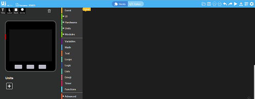
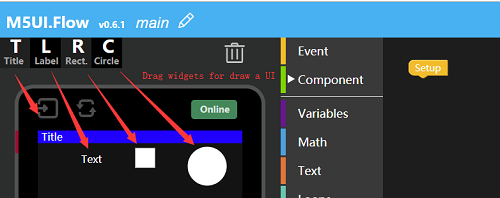

# M5Stack Core Get Started(Windows, Blockly/MicroPython)

This article will guide you for getting started with Blockly(or MicroPython) through [UIFlow](flow.m5stack.com)

### CONTENT

1. [Burn Firmware](#Burn-Firmwared)

    - [1. Download Firmware](#1-download-firmware)

    - [2. Burn to M5Stack](#2-Burn-to-M5Stack)

1. [Connect Wi-Fi](#connect-wi-fi)

3. [Binding device](#binding-device)

4. [Coding MicroPython](#coding-micropython)


### Burn Firmware
#### 1. Download Firmware
https://github.com/m5stack/M5Cloud/tree/master/firmwares

Now, the M5Cloud firmware I downloaded named `m5cloud-20180516-v0.4.0.bin`
and it saved at `~/smbshare`

#### 2. Burn to M5Stack
 |  | 
---|---|---
Windows | Linux | MacOS

***Windows***

open Flash Download Tools([点击下载](https://www.espressif.com/sites/default/files/tools/flash_download_tools_v3.6.4.rar)) apply by Espressif, choose `ESP32 DownloadTool` option and execute three steps ( *choose firmware file, your serial port, erase and program flash* ) as shown below


***MacOS/Linux***

*1. Check port on Linux and MacOS*

  To check the device name for the serial port of your M5Stack board (or external converter dongle), run this command two times, first with the board / dongle unplugged, then with plugged in. The port which appears the second time is the one you need:

  Linux

  ```
  ls /dev/tty*
  ```

  MacOS

  ```
  ls /dev/cu.*
  ```


*2. Adding user to `dialout` on Linux*

The currently logged user should have read and write access the serial port over USB. On most Linux distributions, this is done by adding the user to `dialout` group with the following command:

  ```
  sudo usermod -a -G dialout $USER
  ```
Now, my serial port named `ttyUSB0`

*3. Download M5Cloud firmware to M5Stack board*
  - Installing esptool：
    ```
    pip install esptool
    ```
  - Erase flash on M5Stack:
    ```
    esptool.py --chip esp32 --port /dev/ttyUSB0 erase_flash
    ```
  - Download firmware to M5Stack:
    ```
    esptool.py --chip esp32 --port /dev/ttyUSB0 write_flash --flash_mode dio -z 0x1000 m5cloud-20180516-v0.4.0.bin
    ```

###

Visit the [WebIDE](flow.m5stack.com), it will show as following figure.



Input the `APIKEY` which shows on the screen of M5Stack Core(Now, my APIKEY is `9C6469`) and click `SAVE`, that means your PC will bond with this Core so that you do not need to input `9C6469` again next time.


Then connect it


At the moment, you can draw a UI or program it through Blockly(or Python) as shown below.


**Draw a UI**




### Connect Wi-Fi


Mobile Phone or PC connect to M5Stack AP(like `M5Stack-a67c`), and then open brower to login 192.168.4.1 setting your LAN SSID and Password


### Binding device

*1.login http://io.m5stack.com and register your own account(or login your account)*

*2. press `Device->Add` buttom on M5Cloud IDE for binding M5Stack board to your account*

*3. Input the Check Code for the M5Stack screen display，Check Code is random, after 60s will refresh*


### Coding MicroPython

*1. create a new python project*


*2. write your own code and press `Upload & Run` buttom on the M5Cloud IDE*

copy below code to `main.py` file and press `Upload & Run`

``` python
from m5stack import lcd

lcd.clear()
lcd.setCursor(0, 0)
lcd.setColor(lcd.WHITE)

lcd.print("Hello World!")

```


