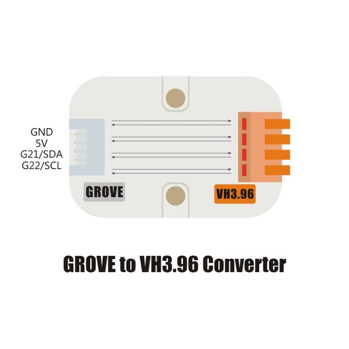

Unit 3.96port
=============

DESCRIPTION
-----------

The Unit 3.96port is a unit that aim to transfer GROVE interface to VH3.96-4Pin.

FEATURES
--------

-  VH3.96 interface
-  Two Lego installation holes
