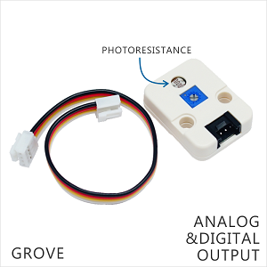

Unit light
=============

DESCRIPTION
-----------

The Unit light is a light sensor unit with an adjustable resistor that can detect the environmental light intensity.
You can read analog signal(environmental light intensity) staright or get a digital signal(0/1) that means whether the light exists or not.

FEATURES
--------

-  Adjustable threshold, including 10K adjustable resistor
-  Analog & Digital output
-  Grove interface
-  Two Lego installation holes

DOCUMENTS
---------

-  GitHub

   + `Arduino GitHub <https://github.com>`__

-  `Purchase <https://www.aliexpress.com/store/3226069?spm=2114.search0104.3.5.66051a4dlpB2ti>`_

