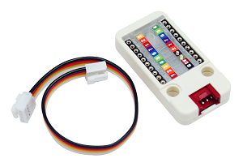

Unit makey
=============

DESCRIPTION
-----------

The Unit makey is a makey unit with 16 touchable pins.

camera module contains thermopile sensors named MLX90640. the MLX90640 contains a 32x64 piexls IR array. It communicates with M5GO Core via GROVE which actually is a I2C interfacel.
As the images show you can detect surface temperatures from many feet away with an accuracy of ±1.5°C (best case).
After burn the firmware of the module's demostatrion to M5GO Core via `M5Burner`, the module will be running. Then you can program it via Arduino IDE.

FEATURES
--------

-  32x24 piexls
-  Target temperature -40°C - 300°C
-  GROVE interface
-  Two Lego installation holes

APPLICATION
------------

-  High precision non-contact temperature measurements
-  Intrusion / Movement detection
-  Visual IR thermometers
-  Temperature sensing element for intelligent building air conditioning

DOCUMENTS
---------

-  GitHub

   + `Arduino GitHub <https://github.com/hkoffer/M5Stack-MLX90640-makey-Camera>`__

   + `MLX90640 Drive GitHub <https://github.com/melexis/mlx90640-library>`__

-  Datasheet

   + `MLX90640 <https://www.melexis.com/-/media/files/documents/datasheets/mlx90640-datasheet-melexis.pdf>`__

-  `QuickStart`_

.. _QuickStart: ../../get-started/M5GO/get_started_M5GO_makeyCam.html

