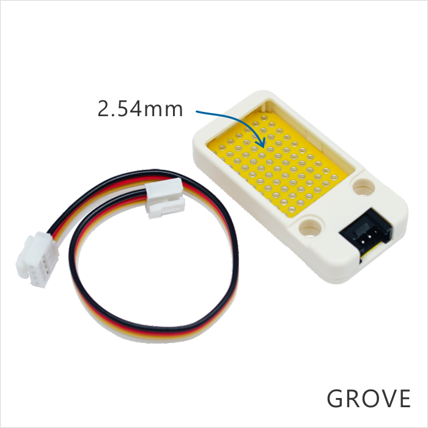

Unit proto
=============

DESCRIPTION
-----------

The M5Stack proto unit is a flexible blank circle with 100mil pitch of holes. You can create any circle
that could controlled by M5GO Core as you like.

FEATURES
--------

-  Flexible extended blank circle
-  70 holes(pitch of holes: 100mil)
-  GROVE interface
-  Two Lego installation holes

