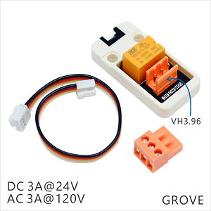

Unit relay
===========

DESCRIPTION
-----------

The Unit relay is a unit that allows you to control large power loads with a light-current, safe, reliable power control system. the large power loads you can safely control is up to 24 VDC or 120 VAC.
Only a low electrial level is sent to this unit, the relay will be close and the large power loads you want to control will be working.

FEATURES
--------
-  A single input
-  Up to 3A @ 24 VDC or 120 VAC
-  GROVE interface
-  Two Lego installation holes

APPLICATION
------------

-  Be perfect for large inductive loads(like DC motors electrocircuit, intelligent interpolation...)
-  Control a standard wall outlet device

DOCUMENTS
---------

-  `Schematic <https://github.com/m5stack/esp32-cam-demo/blob/m5cam/M5CAM-ESP32-A1-POWER.pdf>`__

-  GitHub

   + `Arduino GitHub <https://github.com/hkoffer/M5Stack-MLX90640-Thermal-Camera>`__

